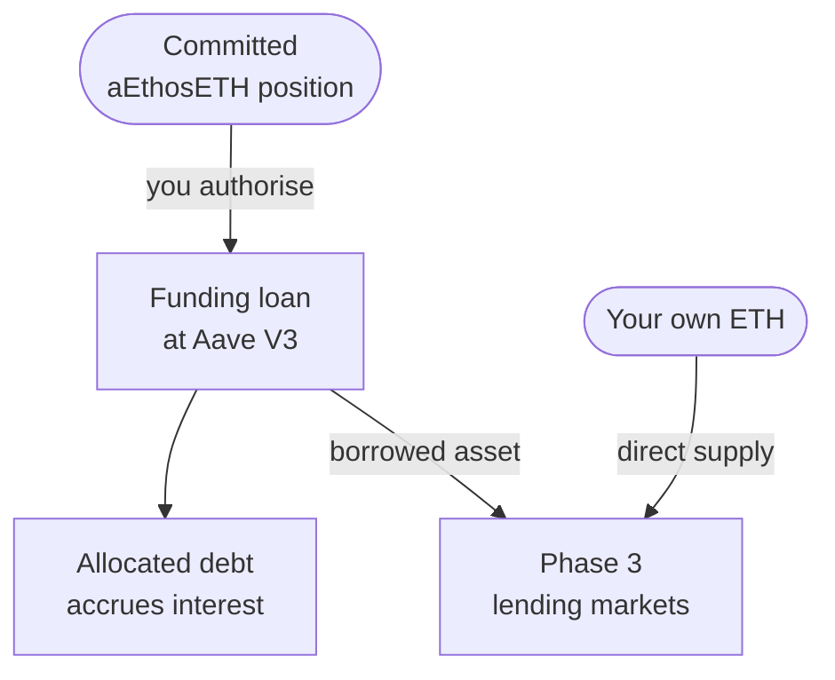

# Funding loan and lending markets

A [funding loan](/glossary#funding-loan) is an optional, user-authorised Aave borrow against your committed aEthosETH position. The borrowed asset becomes liquidity for Definica's Phase 3 [borrowing markets](/glossary#borrowing-markets), where borrowers post approved ETH or ETH-correlated collateral and pay interest.

## The funding loan

One authorised borrow does two things: it records a debt against you and supplies the lending markets. Your own ETH can reach the same markets without any debt.



You borrow WETH or another permitted asset against the supplied position. Availability depends on the selected market, eMode, liquidity and caps. The borrow asset, Aave market and eMode category the Module uses are set by the Module and shown in the app before you confirm. Aave governance can change eMode membership and borrowable flags, so they are read from Aave when you confirm.

The loan is an ordinary Aave V3 borrow and follows Aave's rules:

| Aave rule | Effect on a funding loan |
|---|---|
| [LTV](/glossary#ltv) | Caps how much can be borrowed against the collateral value. |
| [Health factor](/glossary#health-factor) | Must stay at or above 1 after the borrow and after any later withdrawal; below 1 the position can be liquidated. |
| [Variable debt token](/glossary#variable-debt-token) | The debt accrues variable interest continuously, driven by the borrowed reserve's utilisation. |
| [eMode](/glossary#emode) | A correlated-asset category can raise LTV and liquidation threshold, but borrowing is limited to assets in the chosen category that are flagged borrowable. |
| [Borrow cap](/glossary#caps) | A governance-set cap can block new borrowing at any time (`BorrowCapExceeded`). |

:::warning[A separate debt]
The funding loan is a debt in its own right. If you entered through Entry B, the osETH you minted is a second, separate debt at the minting Vault. Neither holding the receipt nor locking it extinguishes either debt. See [Separate obligations](/phase-2/separate-obligations).
:::

## The lending markets

Phase 3 provides defined markets in which this liquidity is borrowed. Liquidity comes from two sources:

1. Funding loans taken through the Module.
2. [Direct ETH supply](/glossary#direct-eth-supply): your own ETH, which enters Phase 3 without Aave funding debt.

Borrowers post approved ETH or ETH-correlated collateral, with osETH as the primary collateral asset, and borrow a supported asset under the market's collateral, interest and liquidation rules. The collateral list, borrow asset, oracle, LTV, liquidation threshold, interest model, caps and liquidation bonus are set per market and shown in the app before you confirm.

If the collateral value falls, the debt grows, or the position otherwise crosses its [liquidation threshold](/glossary#liquidation-threshold), some or all of the collateral can be sold through [liquidation](/glossary#liquidation). A market may also approve aEthosETH as collateral, with its own oracle, LTV, liquidity, lock, redemption and liquidation rules. Correlation with ETH does not remove these risks; see [Correlation is not safety](/risks/correlation-is-not-safety).

## The interest split

Of the [lending interest attributable to you](/glossary#attributable-lending-interest), 75% is allocated to you and 25% to Definica:

```text
I_u                          = lending interest attributable to the participant
Definica revenue             = 0.25 × I_u
User interest allocation     = 0.75 × I_u
Financed net lending result  = 0.75 × I_u − funding costs − other applicable costs
```

The 25% applies to attributable Phase 3 lending interest before upstream financing costs, not to deposited principal or net profit. Because funding costs are subtracted after the split, the net result can be negative: lending losses and funding costs can outweigh returns. Worked examples are in [Economics](/phase-3/economics).

## What you can verify

- On Aave: `getUserAccountData` (health factor, LTV, liquidation threshold, available borrows), `getReserveData` for the borrowed and osETH reserves, and `getEModeCategoryData` for the category in use.
- On Definica: your allocated debt and income, readable onchain from the Module. Your wallet shows the Module's address before you sign; see [Verify addresses](/security/verify-addresses).
- Each market's parameters, shown in the app before you confirm.

## Related

- [Main Liquidity Module](/concepts/main-liquidity-module)
- [Funding loan](/phase-2/funding-loan)
- [Borrowing markets](/phase-3)
- [Borrowing risk](/risks/borrowing)
