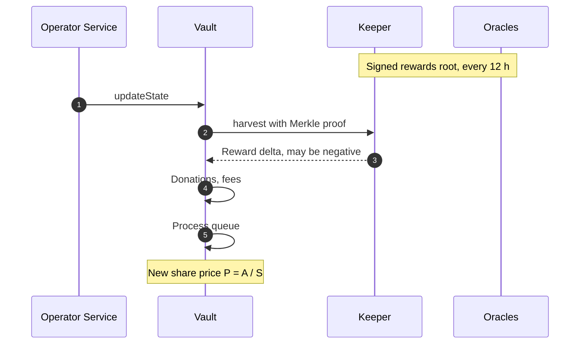

# Keeper and harvests

The [Keeper](/glossary#keeper) is the StakeWise contract that approves validator registrations and processes reward updates for Vaults. A [harvest](/glossary#harvest) applies the latest update to a Vault: rewards and penalties reach your position at harvests, and only at harvests.

## The Oracles

StakeWise's [Oracles](/glossary#oracles) are a signing committee between the Beacon Chain and the Vaults. They report staking rewards and penalties, approve validator registrations and consolidations, and enable validator exits. There are 11 Oracles per chain, and StakeWise sets the signing threshold, currently 6 of 11. The Oracles hold no funds and never submit transactions themselves; they only produce signed attestations.

Every 12 hours the Oracles compute each Vault's consensus-layer rewards and penalties from its validators' Beacon Chain balances and its MEV, build a Merkle tree, upload the snapshot to IPFS and sign an EIP-712 message. The Keeper's `rewardsDelay` is 43,200 seconds, the same 12 hours.

## How a harvest works

A harvest is one call on the Vault, which fetches its latest figures from the Keeper and applies them.

1. Anyone can call `updateState(harvestParams)` on the Vault. By default the Operator Service does so every 12 hours, and a user interaction triggers it when `isStateUpdateRequired()` is true.
2. The Vault calls `Keeper.harvest` with the Merkle proof.
3. The Keeper returns the cumulative reward since the last harvest, negative on penalties or slashing, and the unlocked MEV reward.
4. If the harvest succeeds, ETH donated since the last harvest is added to total assets, and on profit, fee shares worth `profit × feePercent / maxFeePercent` are minted to the fee recipient.
5. The Vault processes the exit queue: queued shares are burned and the matching ETH is set aside for claims.

The result is a new share price `P = A / S`; [Vault shares](/concepts/vault-shares) shows what each step does to `A`, `S` and `P`. DefinicaCore needs no transaction: each user's proportion of Core's shares maps to the new price at once.

## Collateralisation and the activation check

`Keeper.isCollateralized(vault)` checks whether a Vault has registered validators. Once it has them, the Vault must be harvested at every subsequent reward update. DefinicaCore's [activation check](/glossary#activation-check) reads this flag: Core refuses deposits until `Keeper.isCollateralized(vault)` is true for the dedicated Vault. While it is false, the Stake screen disables staking and explains that deposits open once the Vault has registered validators.

## Between harvests

Between harvests the Vault's figures reflect the last reward update, normally no more than 12 hours old. StakeWise provides `isStateUpdateRequired()` and a combined `updateStateAndDeposit(receiver, referrer, harvestParams)` so that a deposit is priced on fresh state. When an update is pending, the app includes it in your transaction.

## What it means for you

- Rewards and penalties reach your position only at harvests, in step with the Vault's reported performance.
- A treasury ETH donation counts only from the next successful harvest.
- Exits are processed at harvests; a request made just after one waits for the next.
- If the Oracles stop reporting, harvests stop, and so does the processing of exits. See [Oracle risk](/risks/oracle).

## What you can verify

- `Keeper.isCollateralized(vault)` and `Keeper.lastRewardsTimestamp()` on the StakeWise Keeper.
- `isStateUpdateRequired()` on the Vault.
- The Oracle set and threshold, published by StakeWise.

The Keeper's address is in [Verify addresses](/security/verify-addresses); the Vault's is on the Contracts card of the Stake screen in the app.

## Related

- [EthPooledStakingVault](/concepts/eth-pooled-staking-vault)
- [Positions and rewards](/phase-1/positions-and-rewards)
- [Oracle risk](/risks/oracle)
