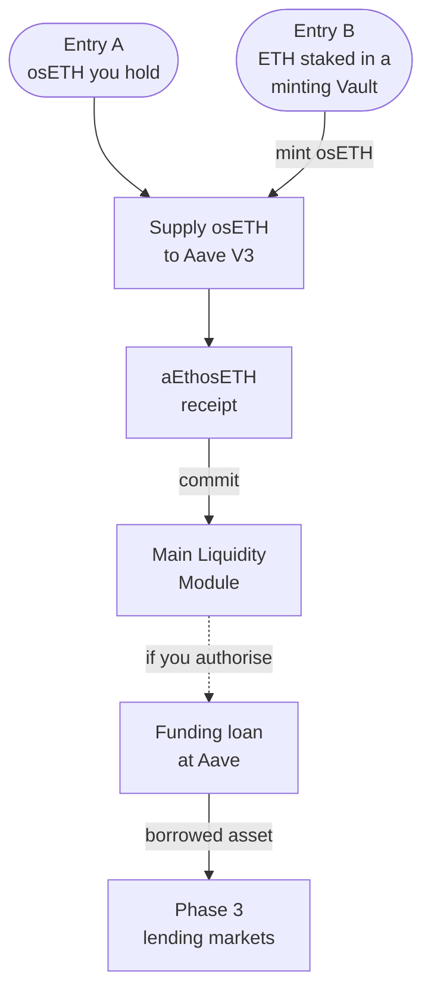

# Main Liquidity Module

The [Main Liquidity Module](/glossary#main-liquidity-module) is Definica's Phase 2 layer for locking Aave-supplied osETH, held as aEthosETH. It records each committed aEthosETH position, its commitment period, any allocated debt and income. With your authorisation, and where the market supports it, it also manages borrowing against those positions through Aave.

## What the Module records

The Module records custody of each committed position and keeps four records per participant:

| Record | What it holds |
|---|---|
| [Commitment](/glossary#commitment) | Which aEthosETH position is committed, and for how long. Also called a lock. |
| Allocated debt | Your share of any Aave [funding loan](/glossary#funding-loan); zero unless you authorise financing. |
| Income | Your 75% share of the Phase 3 lending interest attributable to you, reported apart from osETH staking performance and Aave supply interest. |
| Withdrawal conditions | What must be true for the commitment to be released and the position withdrawn. |

Commitment durations, minimum amounts, capacity and withdrawal rules are set by the Module and shown in the app before you confirm. See [Module rules](/phase-2/module-rules).

## How a position gets there

A position reaches the Module through one of two entries and can then, if you choose, fund a lending market.

- **Entry A** starts from osETH you already hold. A compatible aEthosETH receipt has its osETH supplied already, so it enters the Module directly.
- **Entry B** starts from ETH staked in a separate StakeWise factory Vault that mints osETH. Minting opens an [osToken position](/glossary#ostoken-position), with its own LTV and liquidation threshold and StakeWise's 5% fee on osToken rewards.
- Definica's Phase 1 Vault does not mint osETH and is not part of either entry.

:::warning[Debts persist]
Entry B leaves an osETH liability at the minting Vault, and a funding loan is a further debt at Aave. Neither holding the receipt nor locking it extinguishes either debt.
:::

## Commitment is not collateral

Supplying liquidity and using an asset as collateral are separate actions. A commitment to the Module is a liquidity commitment: locking aEthosETH does not make it collateral, which the relevant market must enable explicitly. A funding loan against the position is a further, opt-in step that requires your authorisation.

A commitment can make supplied liquidity more durable, but it does not guarantee borrowing demand, utilisation, market return, incentives or principal. Lock expiry does not guarantee cash: withdrawing still depends on Aave's available liquidity and on any debt the position carries.

## Separate components, separately reported

The Module accounts for each component on its own line:

- StakeWise staking exposure through osETH.
- Aave's variable supply interest, reflected by aEthosETH.
- Allocated debt and its cost.
- Attributable lending income from Phase 3.
- Any Definica incentives.

Where a [lock-incentive](/glossary#lock-incentives) programme runs for eligible commitments, it is funded separately and has its own budget, duration, eligibility and allocation rules, shown in the app. Incentives are reported alongside staking and supply income, without double counting.

## What you can verify

Your wallet shows the Module's address before you sign; check it on a block explorer as described in [Verify addresses](/security/verify-addresses). You can then read:

- Your commitment, allocated debt and income, onchain from the Module.
- The osETH reserve and the borrowed asset's reserve, via `getReserveData` on the Aave Pool.

## Related

- [The committed-liquidity path](/phase-2/committed-liquidity-path)
- [Module rules](/phase-2/module-rules)
- [Funding loan and lending markets](/concepts/funding-loan-and-lending-markets)
- [Separate obligations](/phase-2/separate-obligations)
