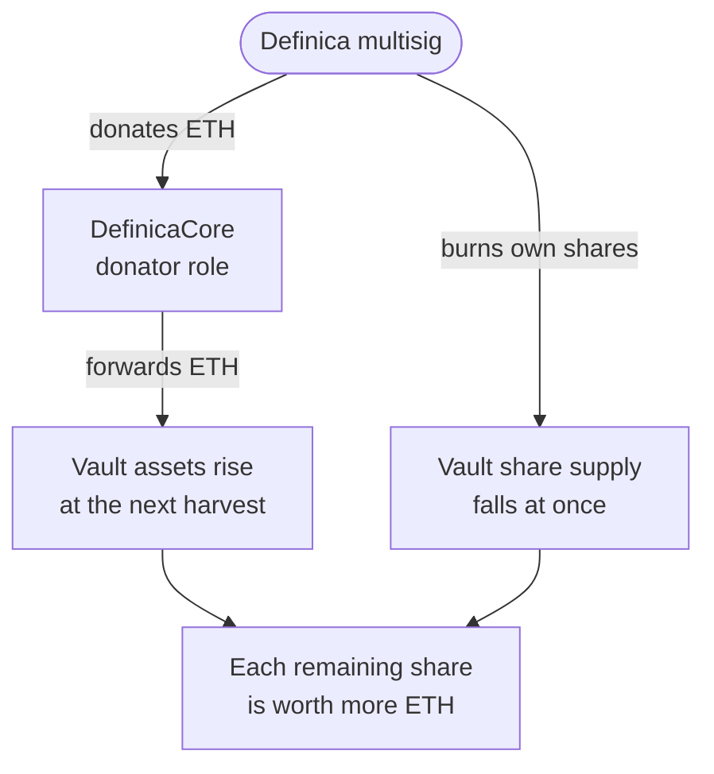

# Treasury

Definica's treasury is a [multisig](/glossary#multisig) that can make discretionary contributions to the dedicated Vault in two ways. An [ETH donation](/glossary#eth-donation) adds ETH without minting shares; a [treasury share burn](/glossary#treasury-share-burn) destroys Vault shares the multisig owns. Either way every remaining share is backed by more ETH, and neither is a guaranteed return.

## Where the funds come from

Protocol-owned revenue and an allocated treasury budget fund the contributions, which Definica's multisig executes. A share burn uses only the multisig's own deposits or fee allocations, never Core's user balances.

## How it works

Both routes end in the same place: more ETH behind each remaining share.

| | ETH donation | Treasury share burn |
|---|---|---|
| Who acts | The multisig, through Core's [donator role](/glossary#donator-role) | The multisig, directly at the Vault, with its own shares |
| Call | `donateAllAssets()` on Core, which calls `donateAssets()` on the Vault | `donateShares()` on the Vault, which burns only the caller's shares |
| Effect | `P_after = (A + D) / S` | `P_after = A / (S − B)` |
| Size | `D / S` more ETH per share | A relative increase of `B / (S − B)` |
| When | At the next successful harvest | Immediately |
| Who benefits | Every remaining share, in proportion | Every remaining share, in proportion |

The formulas isolate the contribution. The share price you see also moves with fees, other rewards or losses, rounding and exit-queue changes.

## Recognition timing

A donated amount sits in the Vault as pending donated assets until the next successful harvest, when StakeWise's accounting adds it to the asset delta. Until then it is not in the share price, and a failed harvest leaves it pending. The app shows each treasury contribution as its own line, separate from rewards.

## What the treasury does not do

- It does not pay a return. Contributions are discretionary and depend on budget; they establish no guaranteed yield.
- It does not favour lockers. A Vault donation is not an exclusive bonus for share locks. Where a lock-incentive programme runs for aEthosETH commitments, it is funded separately, with its own budget and allocation rules.
- It does not buy shares back. Internal Vault shares are not a conventional secondary-market buyback asset.
- It does not touch user balances. A burn uses the multisig's own shares, and the Vault burns only the caller's shares.
- It is not a fee rebate. A donation benefits remaining Vault shares generally; returning fees would be a rebate.

## What you can verify

- `AssetsDonated` and `SharesDonated` events on the Vault, with their amounts.
- The holder of Core's donator role, and the multisig's signers and threshold, readable onchain.
- The share price before and after the next harvest following a donation.

Worked examples of both formulas, with illustrative numbers, are in [Treasury policy](/phase-1/treasury-policy).

## Related

- [Vault shares](/concepts/vault-shares)
- [DefinicaCore](/concepts/definica-core)
- [Keeper and harvests](/concepts/keeper-and-harvests)
