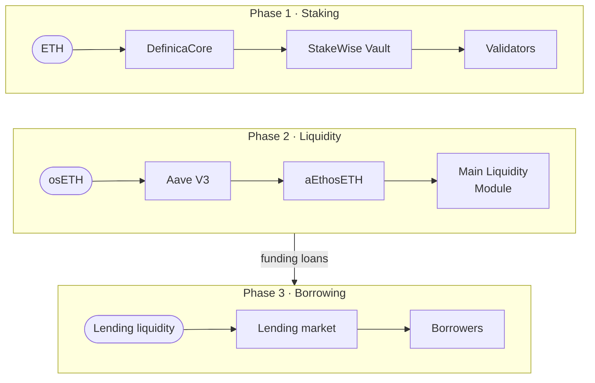

import {Cards, Card} from '@site/src/components/Cards';

# Definica documentation

Definica makes staked ETH easier to use without hiding the mechanics. You pool ETH in a dedicated StakeWise Vault, commit osETH liquidity through Aave V3 Ethereum and borrow against approved ETH-correlated collateral, and every position, return and obligation is shown on its own line.

<Cards>
  <Card to="/phase-1" kicker="Phase 1" title="Pooled ETH staking" tone="sky" blob="green" more="Read Phase 1">Pool your ETH in a dedicated StakeWise Vault and keep a proportional share. No validator to run.</Card>
  <Card to="/phase-2" kicker="Phase 2" title="Main Liquidity Module" tone="baby" blob="lemonade" more="Read Phase 2">Supply osETH to Aave V3 Ethereum, hold aEthosETH and commit it for a fixed duration.</Card>
  <Card to="/phase-3" kicker="Phase 3" title="Borrowing markets" tone="lemonade" blob="sky" more="Read Phase 3">Borrow supported assets against approved ETH-correlated collateral under published rules.</Card>
</Cards>

## What Definica is

Definica is an Ethereum protocol for staking, liquidity and borrowing, built on two established providers: [StakeWise V3](https://docs.stakewise.io/docs/vaults/intro) for the Vault infrastructure and [osETH](/glossary#oseth), and [Aave V3 Ethereum](https://aave.com/docs/aave-v3/overview) for the osETH supply market and the [funding loan](/glossary#funding-loan). Definica does not run its own staking network or its own money market. It coordinates position accounting, funding, commitments, interest allocation, incentives and exits on top of them.

Three ideas run through every phase:

- **Shares, not fixed balances.** Your position is your proportion of the Vault and its net performance after fees. [Vault shares](/glossary#vault-shares) are accounting units, not a one-to-one ETH balance.
- **Every return shown separately.** Staking performance, Aave supply interest, lending income and any incentives are reported as separate components, next to any debt and its cost.
- **Know which contract holds it.** Each layer names the contract that manages it, so you can trace a position from deposit to exit and check it onchain.

## How the phases fit together

Each phase adds one layer, and each can be used on its own.

- **Phase 1, pooled ETH staking.** You send ETH to [DefinicaCore](/glossary#definica-core), which deposits it in [EthPooledStakingVault](/glossary#eth-pooled-staking-vault), a dedicated StakeWise Vault. The Vault funds validators run by its operator, and rewards and penalties reach every share at each [harvest](/glossary#harvest). Core holds the Vault shares in aggregate and records your proportion of them.
- **Phase 2, the Main Liquidity Module.** You supply osETH, StakeWise's liquid staking token, to Aave V3 Ethereum and receive [aEthosETH](/glossary#aethoseth), then commit it to the [Main Liquidity Module](/glossary#main-liquidity-module) for a fixed duration. With your authorisation, the Module can take a funding loan against the position to supply Phase 3.
- **Phase 3, borrowing markets.** Funding loans and [direct ETH supply](/glossary#direct-eth-supply) provide the lending liquidity. Borrowers post approved ETH-correlated collateral and borrow a supported asset. Of the lending interest attributable to you, 75% is allocated to you and 25% to Definica.

The diagram shows the main path through each phase.

Phase 1 and Phase 2 are separate entry points. The Phase 1 Vault does not mint osETH, so Phase 2 starts from osETH you already hold or mint in a separate StakeWise Vault. See [The committed-liquidity path](/phase-2/committed-liquidity-path).

## Where to start

<Cards>
  <Card to="/concepts/vault-shares" title="Understand your position" blob="green">What a Vault share is, and how DefinicaCore records your proportion of the Vault.</Card>
  <Card to="/phase-1/depositing" title="Make a deposit" blob="sky">How ETH reaches the Vault, what you receive and what is checked before it is accepted.</Card>
  <Card to="/app" title="Use the app" blob="lemonade">Each screen of the app, and what it shows you before every transaction.</Card>
  <Card to="/risks" title="Weigh the risks" blob="baby">Validator, contract, market, oracle and borrowing risks, stated plainly.</Card>
  <Card to="/security" title="Check the controls" blob="green">Audits, roles and upgrades, and how to verify every contract address.</Card>
  <Card to="/glossary" title="Look up a term" blob="sky">Every term used in these docs, defined once and linked on first use.</Card>
</Cards>

## Who these docs are for

- **People using Definica** who want to know exactly what a position is, where each return comes from, how it is withdrawn and what can go wrong.
- **Reviewers and integrators** who need the contracts, the control model and the accounting boundaries.

The docs assume you know what a wallet and a transaction are. Protocol terms link to the [Glossary](/glossary) the first time they appear on a page.

:::tip[Before you sign]
Check the network, contract address, function, amount and receiver in your wallet before every transaction. Definica will never ask for your private key or recovery phrase. See [Verify addresses](/security/verify-addresses).
:::
