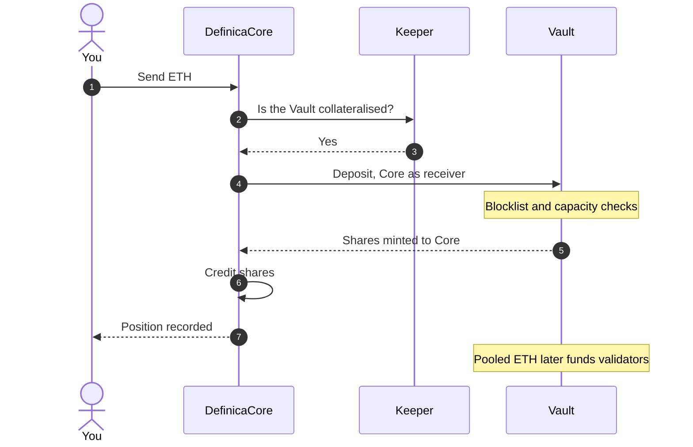

# Depositing

A deposit is one transaction from your wallet to [DefinicaCore](/glossary#definica-core). Core forwards the ETH to the dedicated Vault, receives Vault shares and credits them to you or to a designated [beneficiary](/glossary#beneficiary), and the Vault pools the ETH until validator funding requirements are met.

## Step by step

The sequence below follows one deposit from your wallet to a recorded position.

1. **You send ETH to Core.** The minimum deposit is set for the Vault and shown in the app before you confirm.
2. **Core applies its activation check.** Core refuses deposits until `Keeper.isCollateralized(vault)` is true, which it is once the Vault has registered validators. See [Keeper and harvests](/concepts/keeper-and-harvests).
3. **Core's reentrancy guard runs.** It is built on transient storage; see [Controls and upgrades](/phase-1/controls-and-upgrades).
4. **Core forwards the ETH.** Core calls the Vault's `deposit(receiver, referrer)` with itself as the receiver and you, the caller, as the [referrer](/glossary#referrer). The StakeWise signature is `deposit(address receiver, address referrer) payable returns (uint256 shares)`.
5. **The Vault checks the deposit.** See [Vault-side checks](#vault-side-checks) below.
6. **The Vault mints shares to Core.** `shares = assets × totalShares / totalAssets`, rounded up in StakeWise's implementation.
7. **Core credits your position.** The returned shares are credited internally to you or to a designated beneficiary. Positions are keyed to the Vault's identity and address.
8. **The ETH goes to work.** The Vault pools deposits until validator funding requirements are met, then funds validators; every registration needs Oracle approval. From then on, validator rewards, MEV, fees, penalties and exits all reach you through the Vault's share accounting.

## Receiver, referrer and beneficiary

| Field | Set to | Why it matters |
|---|---|---|
| `receiver` | Core | The Vault mints the shares to Core and sees one depositor. Core's ledger turns that aggregate into per-user positions. |
| `referrer` | You, the caller | Emitted only in the Vault's `Deposited` event. It attributes each pooled deposit onchain to the user who made it, without changing who owns the shares. |
| Beneficiary | You, or a designated account | The account Core credits with the shares. |

## Vault-side checks

| Check | Rule | If it fails |
|---|---|---|
| [Blocklist](/glossary#blocklist) | The Vault checks the blocklist for both the sender and the receiver of the deposit. | The deposit reverts. |
| [Capacity](/glossary#capacity) | The Vault accepts deposits up to an immutable limit set when it was created. | The deposit reverts with `CapacityExceeded`. The app shows the remaining capacity and stops a deposit that exceeds it. |

Shares are priced at the Vault's last harvested state. When a harvest is due (`isStateUpdateRequired()` returns true), StakeWise's `updateStateAndDeposit` applies the harvest and the deposit in one call, so the shares are priced on fresh state.

## How many shares you get

The number of shares you receive differs from the ETH you deposit whenever the share price is not exactly 1. Conversions can round up or down, and small residual amounts can arise. Before you confirm, the app shows the estimated shares (`convertToShares(amount)`) and the current ETH per share. See [Vault shares](/concepts/vault-shares).

## What you see before you confirm

The Stake screen and the transaction review show:

- The Vault's name, network and operator.
- The remaining capacity.
- The Vault fee and any Definica fee, each as a percentage of rewards. See [Fees](/phase-1/fees).
- The minimum deposit.
- The estimated shares and the current share price. Shares are accounting units, not a fixed balance.
- The conditions: rewards depend on validator performance, fees are taken from rewards, and a withdrawal may use available liquidity or require validator exits.

Review the Vault's operator, administrator, fees and permissions as well as the amount; [Controls and upgrades](/phase-1/controls-and-upgrades) shows where to read each one. The app is a convenience layer: it does not replace the contract code, your wallet's confirmation or the onchain record. Before you sign, check the address your wallet shows as [Verify addresses](/security/verify-addresses) sets out.

## Related

- [Stake](/app/stake) in the app
- [Positions and rewards](/phase-1/positions-and-rewards)
- [Smart contract and upgrade risk](/risks/smart-contract-and-upgrade)
