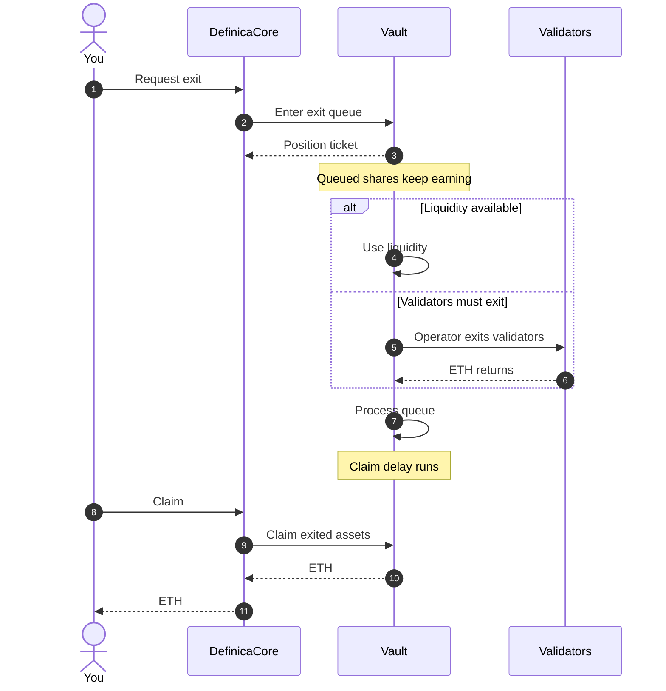

# Exits and withdrawals

Leaving a Phase 1 position takes two transactions with a wait in between. You request an exit and your shares enter the Vault's [exit queue](/glossary#exit-queue), where they keep earning until the Vault burns them; once the request is processed and the Vault's claim delay has passed, you claim the ETH.

The Vault serves each request from available liquidity if it has any, and from validator exits otherwise. You choose whether the exit is managed through Core or routed directly to you at the Vault. On the managed route, a [managed partial claim](/glossary#managed-partial-claim) keeps the remaining exit position for later settlement.

## The flow

The sequence below follows an exit managed through Core. On the direct route you claim at the Vault yourself.

1. **Request.** Choose the shares to exit, or an ETH amount the app converts to shares, and the route: managed through Core or direct to your wallet. Locked shares cannot be requested.
2. **Queue.** Core calls the Vault's `enterExitQueue(shares, receiver)` and a [position ticket](/glossary#position-ticket) is issued. The shares keep earning rewards until the Vault burns them.
3. **Serve.** The Vault covers the request from available liquidity, or validator exits release the ETH first.
4. **Process.** At a harvest the Vault burns the queued shares and sets the ETH aside, creating a checkpoint for your ticket.
5. **Wait out the claim delay.** A claim reverts before the exit timestamp plus the Vault's claim delay.
6. **Claim.** `claimExitedAssets(positionTicket, timestamp, exitQueueIndex)` pays out. If only part of the request has exited, a new ticket holds the remainder.

## Available liquidity versus validator exits

| Where the ETH comes from | When it applies | Timing |
|---|---|---|
| [Unbonded ETH](/glossary#unbonded-eth) in the Vault | ETH not staked in validators, minus what is already queued, exiting or unclaimed (`withdrawableAssets()`) | At the next harvest |
| New deposits | New deposits cover the exit queue first, and only then fund new validators | At the next harvest, if deposits arrive |
| Validator exits | When the two above are not enough. The operator initiates exits; if it has not freed enough assets within the `force_withdrawals_period` (24 hours), the Oracles force them | Set by Ethereum's [validator exit queue](/glossary#validator-exit-queue): a churn limit per epoch, a 256-epoch withdrawability delay, then the withdrawal sweep |

Depending on network conditions, a withdrawal that needs validator exits can take hours or weeks. The actual time depends on Ethereum's validator exit queue, so no timing on this page is a promise.

## The claim delay

The Vault's claim delay (`_exitingAssetsClaimDelay`) is an immutable value fixed when the Vault is deployed. The app reads it from the Vault and shows the time at which each exit position becomes claimable.

## Managed through Core or direct at the Vault

| | Managed through Core | Direct at the Vault |
|---|---|---|
| Receiver | Core | Your wallet |
| Who claims | Core, settling your position | You, at the Vault |
| Partial claims | The remainder stays in your exit position for later settlement | A new ticket is issued to you for the remainder |
| Where you follow it | The Unstake screen in the app | The Unstake screen, or the Vault directly |

You choose the route on the Unstake screen, where it reads **Through Definica** or **Directly at the Vault**, and the transaction review shows it again before you confirm.

## Exit position states

| State | What it means | What you can do |
|---|---|---|
| In queue | Ticket issued; your shares keep earning until the Vault burns them | Wait for processing |
| Waiting for validator exits | Not enough unbonded ETH; validators are exiting | Wait; timing depends on Ethereum's exit queue |
| Processed | Checkpoint created; the claim delay is running | Wait for the claimable time shown in the app |
| Claimable | The claim delay has passed | Claim the ETH |
| Partially claimable | Part of the request is processed | Claim the ready part; the remainder stays queued |
| Claimed | Paid out | Find the entry in [Activity](/app/activity) |

## Practical points

- Request and claim are separate transactions, and a partial claim adds another, so you may need to submit and pay for more than one transaction.
- A queue position shown in the app can be an estimate.
- In StakeWise's design an exit request cannot be cancelled once queued; the shares are burned when the request is processed.
- Shares under a Core lock are excluded until the lock matures and is released.

## What you can verify

- Before you request: `withdrawableAssets()` on the Vault.
- After you request: `getExitQueueIndex(positionTicket)` and `calculateExitedAssets(receiver, positionTicket, timestamp, exitQueueIndex)`.
- The claim delay, read from the Vault.

## Related

- [Exit queue](/concepts/exit-queue)
- [Unstake and the exit queue](/app/withdraw-and-exit-queue) in the app
- [Staking and validator risk](/risks/staking-and-validator)
