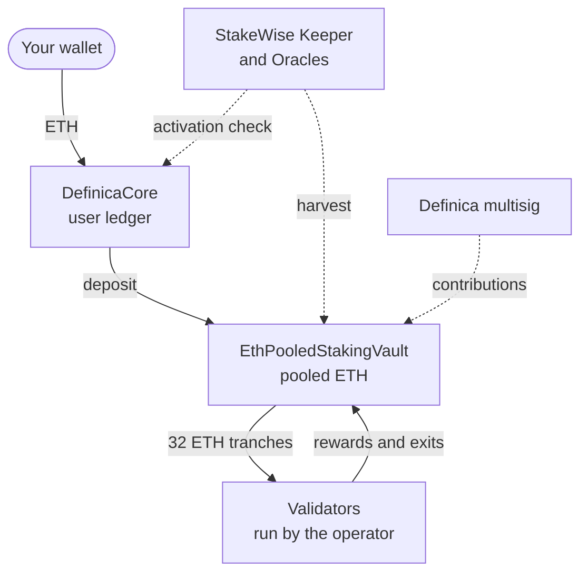

import DocCardList from '@theme/DocCardList';

# Phase 1 — Pooled ETH staking

Phase 1 pools your ETH in a dedicated StakeWise Vault. You keep a proportional share of the pool, recorded by DefinicaCore, and the Vault's validators do the staking, so there is no validator for you to run.

## How it works

You send ETH to [DefinicaCore](/glossary#definica-core). Core forwards it to [EthPooledStakingVault](/glossary#eth-pooled-staking-vault), a dedicated StakeWise [Vault](/glossary#vault) that pools deposits and funds validators run by the selected [operator](/glossary#operator). Rewards, penalties and exits are reflected in the value of [Vault shares](/glossary#vault-shares). Core holds the aggregate shares and records the proportion that belongs to each user, so it tracks principal, shares, rewards, locks and exits for every position.

The diagram shows where your ETH goes and which systems act on it.

- **Deposits.** Core calls the Vault's `deposit(receiver = Core, referrer = caller)`, so the Vault mints the shares to Core and records you as the [referrer](/glossary#referrer).
- **Validators.** The Vault funds validators in 32 ETH tranches.
- **Rewards.** StakeWise's [Keeper](/glossary#keeper) and [Oracles](/glossary#oracles) report rewards and penalties every 12 hours, and the Vault applies them at each [harvest](/glossary#harvest).
- **Activation check.** Core refuses deposits until `Keeper.isCollateralized(vault)` is true, that is, until the Vault has registered validators. See [Activation check](/glossary#activation-check).
- **Treasury.** The Definica [multisig](/glossary#multisig) contributes in one of two ways: it sends ETH through Core's `donateAllAssets()`, which forwards it to the Vault's `donateAssets()`, or it burns shares it owns with a direct `donateShares()` call on the Vault.

Phase 1 is ETH only. The Vault is based on StakeWise's [EthFoxVault](/glossary#ethfoxvault) and does not mint osETH. Exits go through the Vault's [exit queue](/glossary#exit-queue), and optional [share locks](/glossary#share-lock) let you commit shares for a period you choose.

## Components

| Component | What it does | Where it runs |
|---|---|---|
| Your wallet | Sends ETH, requests exits and locks, and signs every transaction after you review it | Your own account |
| [DefinicaCore](/concepts/definica-core) | Routes deposits, holds the aggregate Vault shares, and records each user's position, locks and exits | Definica contract behind an ERC-1967 proxy |
| [EthPooledStakingVault](/concepts/eth-pooled-staking-vault) | Pools ETH, funds validators, runs the exit queue and mints fee shares | Dedicated StakeWise Vault behind its own ERC-1967 proxy |
| Validators and operator | Stake the pooled ETH; the operator runs the node and validator clients | Ethereum's consensus layer |
| [Keeper and Oracles](/concepts/keeper-and-harvests) | Report rewards and penalties every 12 hours, approve validator registrations and enforce exits | StakeWise infrastructure on Ethereum |
| Definica multisig | Executes treasury contributions | Multisig wallet controlled by Definica |

## Roles

| Role | What it can do | Limits |
|---|---|---|
| User | Deposits, requests exits, claims and locks shares | Locked shares cannot exit before maturity |
| Core admin | Administers Core | Held separately from the upgrade authoriser |
| Core upgrade authoriser | Pre-authorises the next Core implementation | One approval at a time, consumed by the upgrade |
| [Donator](/glossary#donator-role) | Sends ETH to the Vault through `donateAllAssets()` on Core | A donation benefits every remaining share and cannot target one user |
| [Vault admin](/glossary#vault-admin) | Configures the Vault: fee and fee recipient, metadata, role assignments and upgrades | Fee changes stay within StakeWise's limits; upgrades go only to registered implementations |
| [Blocklist manager](/glossary#blocklist) | Updates the blocklist and can force a blocked user's shares into the exit queue | Assigned by the Vault admin |
| [Validators manager](/glossary#validators-manager) | Registers, funds, consolidates and withdraws validators | Every registration needs Oracle approval |
| Fee recipient | Receives the Vault fee as newly minted shares at each profitable harvest | Paid from rewards only, never from principal |
| StakeWise DAO | Approves Vault implementations and factories, and selects the Oracles | Cannot change or upgrade a Vault's contracts unilaterally |

The holder of each role is readable onchain. [Controls and upgrades](/phase-1/controls-and-upgrades) shows where to read each one.

## The lifecycle of a position

1. **Deposit.** ETH goes to Core, which forwards it to the Vault with Core as receiver and you as referrer. Core credits the returned shares to you or to a designated [beneficiary](/glossary#beneficiary). See [Depositing](/phase-1/depositing).
2. **Accrue.** Every 12 hours the Oracles report; at the next harvest the Vault's share price moves, and every position moves with it. See [Positions and rewards](/phase-1/positions-and-rewards).
3. **Lock, if you choose.** You can lock shares for 7 to 365 days, with up to 10 lock positions open. Locked shares keep earning. See [Share locks](/phase-1/share-locks).
4. **Exit.** Your shares enter the exit queue, the Vault serves the request from available liquidity or validator exits, and after the Vault's claim delay you claim the ETH. See [Exits and withdrawals](/phase-1/exits-and-withdrawals).

Alongside these, the Definica multisig can make discretionary contributions ([Treasury policy](/phase-1/treasury-policy)), the Vault fee comes out of rewards ([Fees](/phase-1/fees)), and a defined control model governs both contracts ([Controls and upgrades](/phase-1/controls-and-upgrades)).

## What Phase 1 is not

- **Not liquid staking.** Vault shares are non-transferable and the Vault does not mint osETH, so there is no token to trade.
- **Not instant withdrawal.** Exits go through a queue and may require validator exits.
- **Not a yield product.** Rewards depend on validator performance, treasury contributions are discretionary, and no APY is guaranteed.
- **Not Phase 2 or Phase 3.** Core locks are separate from aEthosETH commitments, and Phase 1 involves no lending or borrowing. See [Phase 2](/phase-2) and [Phase 3](/phase-3).

## What you can verify

Every Phase 1 contract can be checked onchain: the Vault's registry entry, collateralisation, capacity, fee, admin and version; Core's proxy slots and its aggregate share balance at the Vault; and the holder of every role. Definica's contract addresses are listed on the Contracts card of the Stake screen in the app, and your wallet shows them again before you sign. [Verify addresses](/security/verify-addresses) lists every check.

## In this section

<DocCardList />
