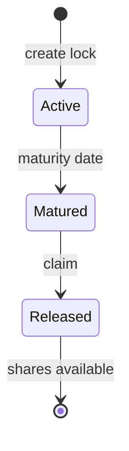

# Share locks

A Phase 1 [share lock](/glossary#share-lock) commits a chosen number of your Vault shares in [DefinicaCore](/glossary#definica-core) for 7 to 365 days, with up to 10 lock positions open at once. Locked shares stay in reward accounting, so they earn and lose exactly as unlocked shares do; what they cannot do is enter the exit queue before maturity.

## How a lock works

A lock moves through three states. A matured lock needs one more action before its shares are available again.

1. **Create.** Choose the shares and a duration between 7 and 365 days. The app shows the maturity date and how many of your 10 lock positions are in use.
2. **Hold.** The shares stay in reward accounting. They cannot be requested for exit.
3. **Mature.** Core keeps matured, unclaimed locks apart from active ones. A matured lock still needs a claim or accounting action before its shares are available.
4. **Release.** After that action the shares are ordinary shares again: you can exit them or lock them again.

Core keeps historical snapshots for position analysis, so a lock's history can be shown over time.

:::warning[No early unlock]
Early unlocking may be impossible, even in adverse market, validator, protocol or security conditions. Lock only shares you can leave committed until maturity.
:::

## Parameters

| Parameter | Value |
|---|---|
| Minimum duration | 7 days |
| Maximum duration | 365 days |
| Open lock positions | Up to 10 |
| Effect on rewards | None: locked shares remain part of reward accounting |
| Early unlock | May be impossible |

## What a lock is for

A Core lock is a commitment of shares for the period you choose. It carries no bonus, multiplier or governance right, and locked shares earn exactly what unlocked shares earn. Treasury contributions do not change this: a Vault donation benefits every remaining share and creates no exclusive bonus for lockers. Lock shares for the commitment itself, not in the expectation of a reward.

## Core locks are not Phase 2 commitments

Core locks are separate from aEthosETH commitments. A Phase 2 [commitment](/glossary#commitment) concerns an Aave aEthosETH position, follows the [Module rules](/phase-2/module-rules) and can carry a separately funded [lock incentive](/glossary#lock-incentives). A Core lock concerns Vault shares in Phase 1 and has none of those. [Share locks](/concepts/share-locks) under Concepts compares the two side by side.

## What you see in the app

The Share locks screen shows your locked shares, your open lock positions out of 10, the matured locks ready to release and the next maturity date. Before you confirm a new lock, the app shows the duration, the maturity date, that locked shares keep accruing rewards, and how many lock positions will be open after it.

## What you can verify

On Core: each lock record (shares, start, maturity and state) and the events Core emits when a lock is created, matures and is released. [Verify addresses](/security/verify-addresses) sets out how to check Core's address.

## Related

- [Share locks](/app/share-locks) in the app
- [Exits and withdrawals](/phase-1/exits-and-withdrawals)
- [Share locks](/concepts/share-locks) under Concepts
