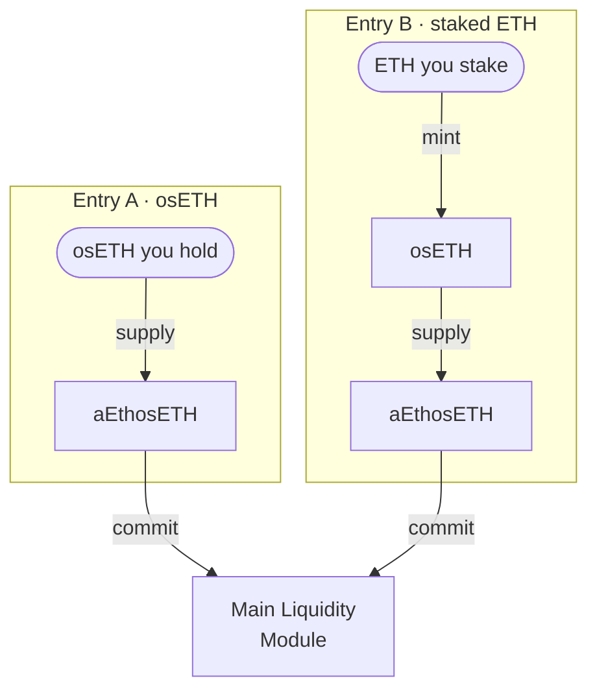

# The committed-liquidity path

There are two ways into Phase 2. [Entry A](/glossary#entry-a-and-entry-b) starts from osETH you already hold, or from a compatible aEthosETH receipt; Entry B starts from ETH that you stake in a separate StakeWise Vault that mints osETH. Both end with aEthosETH committed to the [Main Liquidity Module](/glossary#main-liquidity-module).

## The two entries

Both routes reach the Module through the same supply step.

A compatible aEthosETH receipt that you already hold joins Entry A at the aEthosETH step: its osETH is already supplied, so it enters the commitment layer directly.

| | Entry A | Entry B |
|---|---|---|
| Starting asset | osETH, or a compatible aEthosETH receipt | ETH |
| Minting step | None | At a separate StakeWise factory Vault |
| osETH liability | None | Yes, at the minting Vault, with StakeWise's 5% fee on osToken rewards |
| Steps to commit | Supply (unless already supplied), then commit | Stake, mint, supply, commit |
| Steps to exit | Settle osETH and earned balances, without a staking exit | Repay, withdraw, burn osETH including fees, then exit the stake |

## Entry A in detail

1. **Supply.** Your osETH is supplied to the Aave V3 Ethereum Pool. aEthosETH is minted at the current rate and starts to accrue variable supply interest. The supply fails if the reserve is inactive, frozen or paused, or if its supply cap is reached. See [Aave V3 supply and aEthosETH](/phase-2/aave-supply-and-aethoseth).
2. **Commit.** You commit the aEthosETH position to the Module for the duration you choose, under the [Module rules](/phase-2/module-rules). A compatible receipt you already hold starts at this step.
3. **Optionally authorise financing.** See [Funding loan](/phase-2/funding-loan).

## Entry B in detail

1. **Stake** ETH in a separate StakeWise factory Vault that supports osToken minting. This is not Definica's Phase 1 Vault.
2. **Mint osETH** against your Vault shares. This opens an [osToken position](/glossary#ostoken-position) with an LTV limit (90% in Standard Vaults) and a liquidation threshold (92% in those Vaults). The StakeWise DAO's 5% fee on osToken rewards accrues to the debt.
3. **Supply and commit** as in Entry A.

Minting osETH against stake leaves an osETH liability at the originating Vault, and it stays there for the life of the position. See [Separate obligations](/phase-2/separate-obligations).

## Why the Phase 1 Vault is not an entry

Definica's Phase 1 Vault, [EthPooledStakingVault](/glossary#eth-pooled-staking-vault), is based on EthFoxVault and does not mint osETH. That is a property of the Vault type, which omits StakeWise's osToken module entirely. To go from ETH to osETH you use Entry B's minting Vault. If you hold Phase 1 shares, you exit Phase 1 through the [exit queue](/phase-1/exits-and-withdrawals) and enter Phase 2 separately.

## What the Module records at commitment

The Module records custody and debt. For each participant it keeps:

- the committed aEthosETH position;
- the commitment period;
- allocated debt, which is zero unless you authorise financing;
- income;
- the withdrawal conditions.

Commitment durations, amounts and capacity are set by the Module and shown in the app before you commit. See [Module rules](/phase-2/module-rules) and [Main Liquidity Module](/concepts/main-liquidity-module).

## Related

- [osETH](/concepts/oseth)
- [aEthosETH](/concepts/aethoseth)
- [Closing a financed position](/phase-3/closing-a-financed-position)
