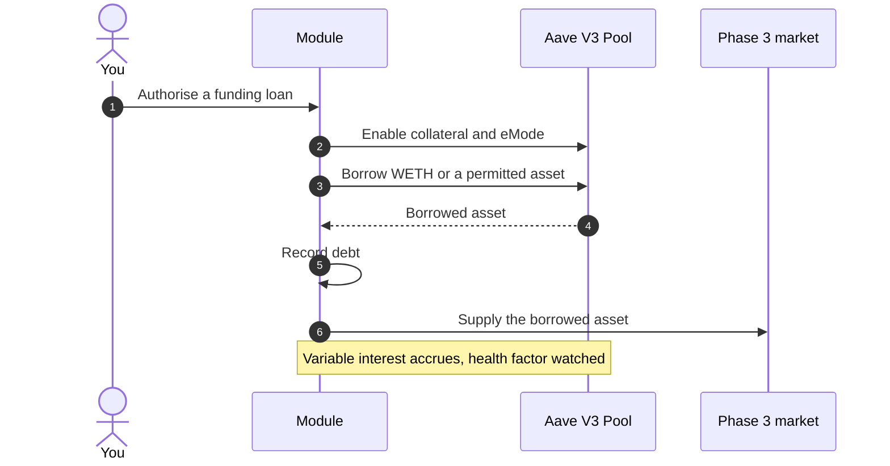

# Funding loan

The [funding loan](/glossary#funding-loan) is optional financing in Phase 2. With your authorisation, WETH or another permitted asset is borrowed at Aave V3 against your committed aEthosETH; the Module records the loan as your allocated debt, and the borrowed asset supplies the Phase 3 borrowing markets. Availability depends on the selected market, eMode, liquidity and caps.

## How it works

Once you authorise financing, the loan is set up in this order.



The loan is an ordinary Aave V3 borrow and follows Aave's rules, set out below.

:::warning[The debt persists]
The funding loan is a real debt with variable interest and liquidation risk. Neither receipt ownership nor a lock extinguishes it; only repayment does.
:::

## Aave rules that govern the loan

| Rule | What it does | Where to read it |
|---|---|---|
| [LTV](/glossary#ltv) | Caps the borrow at a percentage of the collateral value. LTV is a borrowing constraint, not an allocation key. | `getUserAccountData` |
| [Liquidation threshold](/glossary#liquidation-threshold) and [health factor](/glossary#health-factor) | The health factor must stay at or above 1; below 1 the position can be liquidated. | `getUserAccountData` |
| [eMode](/glossary#emode) | A correlated-asset category can raise LTV and threshold, but borrowing is restricted to assets in the chosen category that are flagged borrowable. Aave governance has reduced the borrowable set of the Ethereum ETH-correlated category to WETH only. | `getEModeCategoryData` |
| [Borrow cap](/glossary#caps) | Limits total borrowing of the asset; reaching it blocks new borrows (`BorrowCapExceeded`). | `getReserveData(WETH)` |
| [Variable debt](/glossary#variable-debt-token) | Interest accrues continuously, driven by the WETH reserve's utilisation. | `getReserveData(WETH)` |

The borrow asset, the Aave market and the eMode category a funding loan uses are set by the Module and shown in the app before you authorise.

## Allocated debt

The Module records custody and debt, and tracks each participant's commitment, allocated debt, income and withdrawal conditions. Your allocated debt is the share of the funding loan recorded against your position. The app shows it with its accrued interest and the loan's health factor. The Module watches that health factor and responds as it falls, under the [Module rules](/phase-2/module-rules).

## How to think about the cost

StakeWise's Boost product runs the same loop on Aave (osETH as collateral, borrow ETH, restake), and its documentation states the economics plainly: the result depends on the spread between the Vault's staking rate and Aave's variable WETH borrow rate, and it turns negative when the borrow rate exceeds the staking rate. For a funding loan, the comparison is between your 75% allocation of Phase 3 lending interest and the funding cost:

```text
Financed net lending result = 0.75 × I_u − funding costs − other applicable costs
```

Lending losses and funding costs can outweigh returns. Worked examples, including a negative one, are in [Economics](/phase-3/economics).

## What authorisation means

Financing is opt-in. Before you authorise, the app shows the asset, the eMode category, the LTV and liquidation threshold that apply, the current variable borrow rate, the caps, the resulting allocated debt and the health factor after the borrow. Authorisation is explicit consent; a commitment alone does not create debt.

## What you can verify

- On Aave: `getUserAccountData` for the health factor, LTV, liquidation threshold and available borrows; `getReserveData` for the WETH and osETH reserves; `getEModeCategoryData` for the category in use.
- In the app: your allocated debt, its accrued interest and the loan's health factor.

## Related

- [Funding loan and lending markets](/concepts/funding-loan-and-lending-markets)
- [Separate obligations](/phase-2/separate-obligations)
- [Liquidation](/phase-3/liquidation)
- [Borrowing risk](/risks/borrowing)
