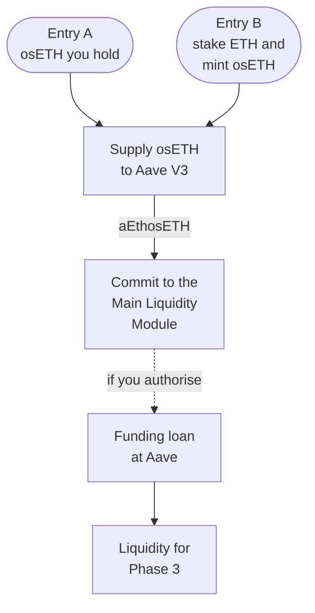

import DocCardList from '@theme/DocCardList';

# Phase 2 — Main Liquidity Module

Phase 2 turns staking exposure into committed liquidity. You supply [osETH](/glossary#oseth) to Aave V3 Ethereum, hold the resulting [aEthosETH](/glossary#aethoseth) and commit it to the [Main Liquidity Module](/glossary#main-liquidity-module) for a fixed duration. If you choose, you also authorise a [funding loan](/glossary#funding-loan) against the committed position, and the borrowed asset supplies the Phase 3 borrowing markets.

## What the Module does

The Main Liquidity Module coordinates position accounting, funding, commitments, interest allocation, incentives and exits. For each participant it records the committed position, the commitment period, any allocated debt, income and the withdrawal conditions.

Each component of a position is accounted for separately: osETH staking exposure, Aave supply interest, allocated debt and its cost, lending income and any incentives.

## How it works

The path runs from osETH to Phase 3 liquidity, and the funding loan is optional.

If you already hold a compatible aEthosETH receipt, you skip the supply step and commit it directly. The Phase 1 Vault, EthPooledStakingVault, does not mint osETH and is not part of either entry.

| Step | What happens | Read more |
|---|---|---|
| Enter | You bring osETH or a compatible aEthosETH receipt (Entry A), or stake ETH in a separate StakeWise Vault that mints osETH (Entry B). | [The committed-liquidity path](/phase-2/committed-liquidity-path) |
| Supply | Your osETH is supplied to Aave V3 Ethereum; aEthosETH is minted and accrues variable supply interest. | [Aave V3 supply and aEthosETH](/phase-2/aave-supply-and-aethoseth) |
| Commit | The Module records custody, the commitment period, allocated debt and income. | [Main Liquidity Module](/concepts/main-liquidity-module) |
| Finance (optional) | A funding loan at Aave, authorised by you, supplies Phase 3. | [Funding loan](/phase-2/funding-loan) |
| Exit | Repay, withdraw to osETH, settle any minting debt, then exit the stake. | [Closing a financed position](/phase-3/closing-a-financed-position) |

## What Phase 2 is not

- **Not a second staking return.** aEthosETH does not create a second ETH deposit or duplicate the osETH staking return.
- **Not automatic collateral.** Locking aEthosETH does not make it collateral. A market has to enable it as collateral explicitly.
- **Not a guarantee.** A commitment can make supplied liquidity more durable, but it does not guarantee borrowing demand, utilisation, market return, incentives or principal preservation.
- **Not a Phase 1 share lock.** Core share locks and aEthosETH commitments are separate mechanisms.

## Where the returns and costs come from

| Layer | Return | Cost or drag |
|---|---|---|
| osETH exposure | StakeWise staking performance, through the osETH exchange rate | StakeWise's 5% fee on osToken rewards, on minted positions (Entry B only) |
| Aave supply | Variable supply interest in the aEthosETH balance | Aave's reserve factor; depends on utilisation |
| Funding loan | Liquidity for Phase 3 lending | Variable borrow interest; liquidation risk; caps can block new borrowing |
| Phase 3 lending | 75% of attributable lending interest | Lending losses; other applicable costs |
| Lock incentives | A separately funded programme, where one runs | Limited by its budget; never a guaranteed return |

Lending losses and funding costs can outweigh returns. Each layer is reported on its own line and never blended; worked examples are in [Economics](/phase-3/economics). Any osETH minting debt and any Aave debt are separate obligations that persist until repaid; see [Separate obligations](/phase-2/separate-obligations).

## What you see in the app

The Liquidity Module screen shows the committed-liquidity path, the commitment form and what the Module tracks for you: commitment, allocated debt, income and withdrawal conditions. The obligations on your position are listed apart from its returns. See [Liquidity and borrowing in the app](/app/liquidity-and-borrowing).

## In this section

<DocCardList />
