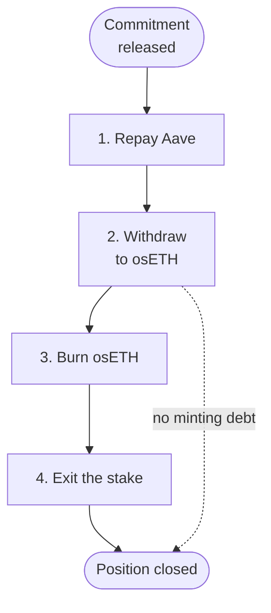

# Closing a financed position

Closing a financed position reverses the path in: you repay the funding loan, withdraw the aEthosETH to osETH, settle any osETH minting liability, then exit the stake. Each step depends on the one before it. Lock expiry does not guarantee cash, and withdrawals at Aave are subject to reserve liquidity and collateral constraints.

## The four steps

The steps start once the commitment has matured or been released under the [Module rules](/phase-2/module-rules).

1. **Recover liquidity and repay Aave.** Use the asset owed to cover attributable principal and accrued interest. The debt has grown with variable interest. If the supplied asset is lent out in the market, recovering it depends on utilisation and the market's withdrawal conditions.
2. **Withdraw the osETH supply position.** Redeem aEthosETH through Aave, subject to reserve liquidity and collateral constraints. Aave refuses with `NotEnoughAvailableUserBalance` if the osETH reserve lacks unborrowed liquidity, and with `HealthFactorLowerThanLiquidationThreshold` if a remaining borrow would be left under-collateralised.
3. **Settle a minting liability, where present.** Burn enough osETH, including accrued fees, at the factory Vault that minted it, and cover any shortfall. The 5% osToken fee has accrued to the debt, so more osETH is needed than was minted.
4. **Exit the released stake and settle balances.** Use the Vault exit process, and account for remaining funds, interest and earned incentives. The minting Vault's exit queue and Ethereum's validator exit queue set the timing, which is not promised.

To exit, a position is first unlocked and withdrawn from Aave into osETH. Converting osETH into ETH is a separate, final step.

## Variations

- **Entry A, no minting debt.** You settle osETH and earned balances without a staking exit. You stop after step 2 and hold osETH, which you can keep, sell or redeem through StakeWise's [redemption queue](/glossary#oseth-redemption) (it runs a 12-hour checkpoint and can force validator exits).
- **Direct ETH suppliers** exit through Phase 3 withdrawals. With no Aave debt and no aEthosETH, the exit depends on the lending market's withdrawal conditions.
- **Phase 3 borrowers** repay their loan to release their collateral.

## What to expect

- Several transactions, in sequence, each paying gas.
- Waits at Aave (liquidity), at the minting Vault (exit queue) and on Ethereum (validator exits), none of which Definica controls.
- Possible shortfalls: the funding cost can exceed the lending allocation (see [Economics](/phase-3/economics)), and the osETH burn requires fees on top of principal.
- If a liquidation occurred along the way, any liquidation fee is separate from debt repayment and liquidator compensation.

## Related

- [Separate obligations](/phase-2/separate-obligations)
- [Aave V3 supply and aEthosETH](/phase-2/aave-supply-and-aethoseth)
- [Exit queue](/concepts/exit-queue)
