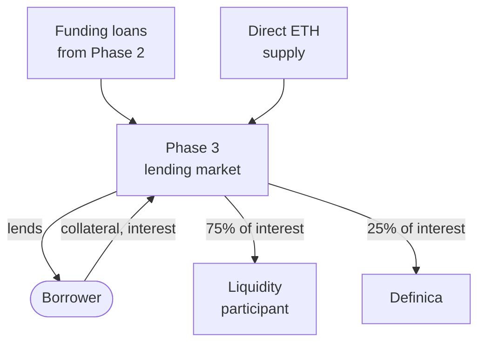

import DocCardList from '@theme/DocCardList';

# Phase 3 — Borrowing markets

Phase 3 runs Definica's [borrowing markets](/glossary#borrowing-markets): you borrow a supported asset against approved ETH or ETH-correlated collateral, under published collateral, interest and liquidation rules. The liquidity comes from Phase 2 [funding loans](/glossary#funding-loan) and from [direct ETH supply](/glossary#direct-eth-supply). Of the interest attributable to a liquidity participant, 75% is allocated to the participant and 25% to Definica.

## What Phase 3 does

Phase 3 provides defined markets in which the liquidity from Phase 2 is borrowed. It lets you use an approved ETH-correlated position as collateral and borrow a supported asset without first selling your underlying exposure.

## How it works

Liquidity flows into a market from two sources, borrowers take loans from it, and the interest they pay is split.

Borrowers post approved collateral, borrow a supported asset and pay interest. Direct ETH supply is your own ETH, with no Aave funding debt. If the collateral value falls, the debt grows or the position otherwise crosses its liquidation threshold, some or all of the collateral can be sold through [liquidation](/phase-3/liquidation).

## Who participates

| Participant | Brings | Receives | Bears |
|---|---|---|---|
| Liquidity participant through Phase 2 | A funding loan's proceeds | 75% of attributable lending interest | Funding cost, lending losses, liquidation risk at Aave |
| Direct ETH supplier | Own ETH | 75% of attributable lending interest | Lending losses; exits through Phase 3 withdrawals |
| Borrower | Approved collateral | A supported asset | Interest, oracle risk and liquidation risk |

Definica coordinates the markets and receives 25% of attributable lending interest. Its share supports development, operations and budgeted treasury and incentive programmes.

## Market rules

Each market sets its approved collateral, supported borrow asset, oracle, maximum LTV, liquidation threshold, interest-rate model, caps, liquidation process and emergency controls. The app shows them before you confirm. See [Market parameters](/phase-3/market-parameters).

## What Phase 3 is not

- **Not a guarantee of liquidity for lenders.** Lock expiry does not guarantee cash. Withdrawal depends on utilisation and the market's withdrawal conditions.
- **Not a guarantee that borrowers keep their collateral.** Borrowing without selling does not guarantee that you retain the collateral.
- **Not risk-free because the collateral is ETH-correlated.** ETH-correlated collateral still carries validator, fee, price, liquidity, redemption and contract risks; correlation with ETH does not remove them. See [Correlation is not safety](/risks/correlation-is-not-safety).

## What you see in the app

The Borrow screen lists each market with its parameters, shows your borrow position (collateral, debt and health) and sets out the rules that apply to every market. See [Liquidity and borrowing in the app](/app/liquidity-and-borrowing).

## In this section

<DocCardList />
