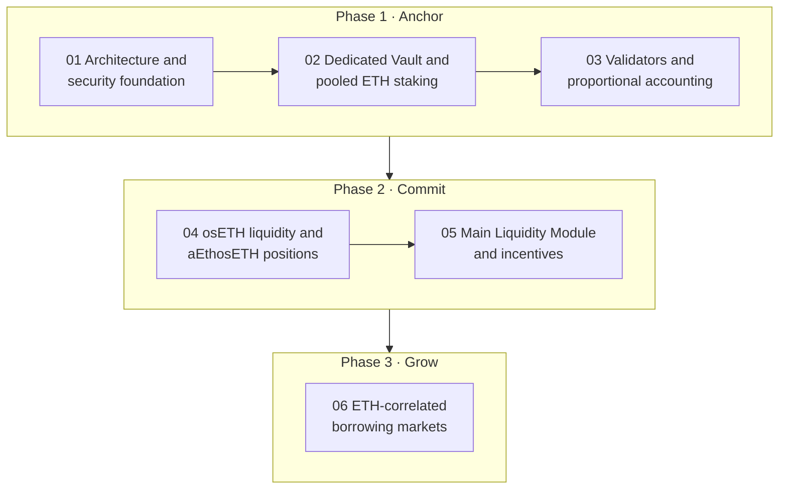

import {Cards, Card} from '@site/src/components/Cards';

# Roadmap

Definica is built in three phases, delivered through six milestones. Each phase creates the conditions for the next: staking first, then committed liquidity, then borrowing. Progress is tied to evidence and readiness rather than to a fixed date.

## The three phases

<Cards>
  <Card to="/phase-1" kicker="Phase 1 · Anchor" title="Pooled ETH staking" tone="sky" blob="green" more="Read Phase 1">ETH pooled in a dedicated StakeWise Vault, with each user's proportional position recorded by DefinicaCore.</Card>
  <Card to="/phase-2" kicker="Phase 2 · Commit" title="Main Liquidity Module" tone="baby" blob="lemonade" more="Read Phase 2">osETH supplied to Aave V3 Ethereum, held as aEthosETH and committed for a fixed duration.</Card>
  <Card to="/phase-3" kicker="Phase 3 · Grow" title="Borrowing markets" tone="lemonade" blob="sky" more="Read Phase 3">Loans against approved ETH-correlated collateral, supplied by committed liquidity and direct ETH.</Card>
</Cards>

| Phase | What it establishes |
|---|---|
| **Phase 1 · Anchor** | The foundation. Eligible ETH is pooled in a dedicated StakeWise Vault and DefinicaCore records each user's proportional position, so nobody has to run a validator. Vault capacity, fees and participation conditions are shown before you confirm. Optional share locks run from 7 to 365 days, with up to 10 lock positions at a time. |
| **Phase 2 · Commit** | Committed liquidity. osETH supplied to Aave V3 Ethereum is represented by aEthosETH and committed to the Main Liquidity Module for a fixed duration under the Module's rules. Optional funding loans, authorised by the user, supply Definica's lending markets. |
| **Phase 3 · Grow** | Borrowing. Markets for approved ETH-correlated collateral, with osETH as the primary collateral asset, where borrowers take supported assets under published collateral, interest and liquidation rules. Of the lending interest attributable to a participant, 75% is allocated to the participant and 25% to Definica. |

## Six milestones

The phases are delivered through six milestones, in the order they depend on each other.

| Milestone | What it covers |
|---|---|
| **01 Architecture and security foundation** | The roles, the accounting boundaries, the review scope and the evidence that accompanies each release. See [Release evidence](/security/release-evidence). |
| **02 Dedicated Vault and pooled ETH staking** | The dedicated StakeWise Vault, its assessment and registry process, and onboarding. |
| **03 Validator activation and proportional accounting** | Validator operations, rewards, exits and the reconciliation of every user position with the Vault. |
| **04 osETH liquidity and aEthosETH position layer** | The separate supply, commitment and financing contracts for osETH and aEthosETH. |
| **05 Main Liquidity Module and long-term incentives** | The Module's funding, lock, allocation, capacity and withdrawal rules, and the lock-incentive programme. |
| **06 ETH-correlated borrowing markets** | Market-specific assets, risk parameters, liquidity and liquidation controls. See [Market parameters](/phase-3/market-parameters). |

## How progress is measured

- **Evidence, not dates.** Each milestone is complete when its evidence is in place: reviewed code, published rules and parameters, and deployed contracts that match them.
- **Each module on its own.** Every module is enabled separately, with its own contracts, parameters and review.
- **The contracts decide.** What you can use is what the app shows as active and connects to published contract addresses. Never move assets on the strength of a roadmap, a screenshot or a post. See [Source of truth](/security/source-of-truth).

## Related

- [Introduction](/)
- [Release evidence](/security/release-evidence)
- [Verify addresses](/security/verify-addresses)
